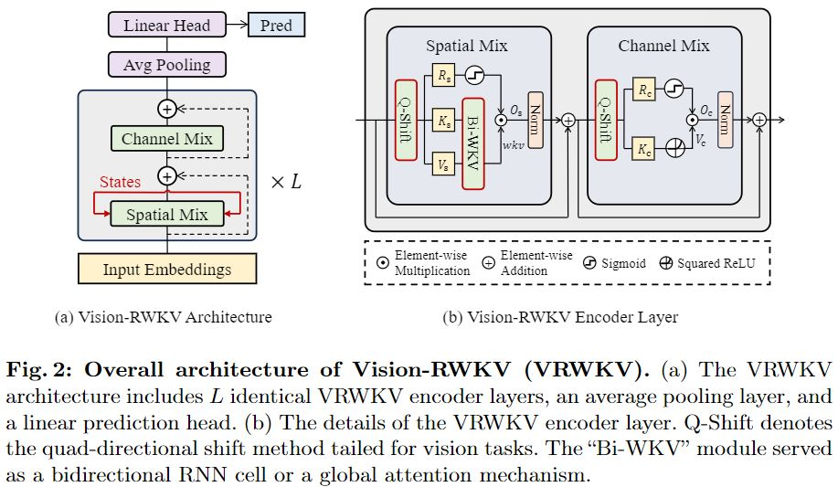

# Vision-RWKV
The official implementation of "Vision-RWKV: Efficient and Scalable Visual Perception with RWKV-Like".

## Abstract
Transformers have revolutionized computer vision and natural language processing, but their high computational complexity limits their application in high-resolution image processing and long-context analysis. This paper introduces Vision-RWKV (VRWKV), a model adapted from the RWKV model used in the NLP field with necessary modifications for vision tasks. Similar to the Vision Transformer (ViT), our model is designed to efficiently handle sparse inputs and demonstrate robust global processing capabilities, while also scaling up effectively, accommodating both large-scale parameters and extensive datasets. Its distinctive advantage lies in its reduced spatial aggregation complexity, which renders it exceptionally adept at processing high-resolution images seamlessly, eliminating the necessity for windowing operations. Our evaluations in image classification demonstrate that VRWKV matches ViT's classification performance with significantly faster speeds and lower memory usage. In dense prediction tasks, it outperforms window-based models, maintaining comparable speeds. These results highlight VRWKV's potential as a more efficient alternative for advanced image analysis tasks.
Code and models shall be available.

## Overview

## Released Models
- Classification(ImageNet-1K)

|  Model  |   Size   | #Param | FLOPs | Top 1-Acc |       Download       |
|:-------:|:--------:|:------:|:-----:|:---------:|:--------------------:|
| VRWKV-T |  $224^2$ |   6.2M |  1.2G |    75.1   | [ckpt](https://huggingface.co/OpenGVLab/Vision-RWKV/resolve/main/vrwkv_t_in1k_224.pth) \| [cfg](classification/configs/vrwkv/vrwkv_tiny_8xb128_in1k.py)  |
| VRWKV-S |  $224^2$ |  23.8M |  4.6G |    80.1   | [ckpt](https://huggingface.co/OpenGVLab/Vision-RWKV/resolve/main/vrwkv_s_in1k_224.pth) \| [cfg](classification/configs/vrwkv/vrwkv_small_8xb128_in1k.py) |
| VRWKV-B |  $224^2$ |  93.7M | 18.2G |    82.0   | [ckpt](https://huggingface.co/OpenGVLab/Vision-RWKV/resolve/main/vrwkv_b_in1k_224.pth) \| [cfg](classification/configs/vrwkv/vrwkv_base_16xb64_in1k.py)  |
| VRWKV-L |  $384^2$ | 334.9M | 189.5G |    85.3   | todo |

- Detection(COCO)

|  Model  | \#Param ${^\star}$ | FLOPs ${^\star}$ | ${\rm AP^b}$ | ${\rm AP^m}$ |       Download       |
|:-------:|:------------------:|:----------------:|:------------:|:------------:|:--------------------:|
| VRWKV-T |        8.4M        |       67.9G      |     41.7     |     38.0     |  [ckpt](https://huggingface.co/OpenGVLab/Vision-RWKV/resolve/main/mask_rcnn_vrwkv_adapter_tiny_fpn_1x_coco.pth) \| [cfg](detection/configs/mask_rcnn/mask_rcnn_vrwkv_adapter_tiny_fpn_1x_coco.py) |
| VRWKV-S |       29.3M        |      189.9G      |     44.8     |     40.2     |  [ckpt](https://huggingface.co/OpenGVLab/Vision-RWKV/resolve/main/mask_rcnn_vrwkv_adapter_small_fpn_1x_coco.pth) \| [cfg](detection/configs/mask_rcnn/mask_rcnn_vrwkv_adapter_small_fpn_1x_coco.py) |
| VRWKV-B |      106.6M        |      599.0G      |     46.8     |     41.7     |  [ckpt](https://huggingface.co/OpenGVLab/Vision-RWKV/resolve/main/mask_rcnn_vrwkv_adapter_base_fpn_1x_coco.pth) \| [cfg](detection/configs/mask_rcnn/mask_rcnn_vrwkv_adapter_base_fpn_1x_coco.py) |
| VRWKV-L |      351.9M        |     1730.6G      |     50.6     |     44.9     | todo |

- Segmentation(ADE20K)

|  Model  | \#Param ${^\star}$ | FLOPs ${^\star}$ |   mIOU   |       Download       |
|:-------:|:------------------:|:----------------:|:--------:|:--------------------:|
| VRWKV-T |        8.4M        |       16.6G      |   43.3   |  [ckpt](https://huggingface.co/OpenGVLab/Vision-RWKV/resolve/main/upernet_vrwkv_adapter_tiny_512_160k_ade20k.pth) \| [cfg](segmentation/configs/ade20k/upernet_vrwkv_adapter_tiny_512_160k_ade20k.py) |
| VRWKV-S |       29.3M        |       46.3G      |   47.2   |  [ckpt](https://huggingface.co/OpenGVLab/Vision-RWKV/resolve/main/upernet_vrwkv_adapter_small_512_160k_ade20k.pth) \| [cfg](segmentation/configs/ade20k/upernet_vrwkv_adapter_small_512_160k_ade20k.py) |
| VRWKV-B |      106.6M        |      146.0G      |   49.2   |  [ckpt](https://huggingface.co/OpenGVLab/Vision-RWKV/resolve/main/upernet_vrwkv_adapter_base_512_160k_ade20k.pth) \| [cfg](segmentation/configs/ade20k/upernet_vrwkv_adapter_base_512_160k_ade20k.py) |
| VRWKV-L |      351.9M        |      421.9G      |   53.5   | todo |

## Citation
If this work is helpful for your research, please consider citing the following BibTeX entry.

## License
This repository is released under the Apache 2.0 license as found in the [LICENSE](LICENSE) file.